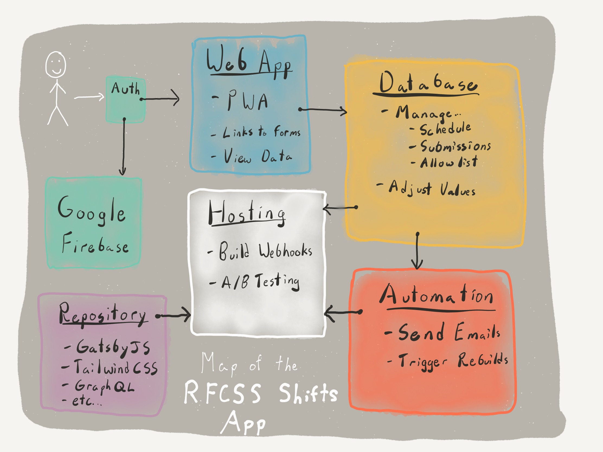

# Other Components

The other components of the RFCSS Shifts service won't need to be accessed as often, and caution should be exercised when modifying them. If unsure, have a few people do it with you as they may catch errors that you do not.

The other components consist of:

- Automation
- Hosting
- Repository
- Authentication (Google Firebase)