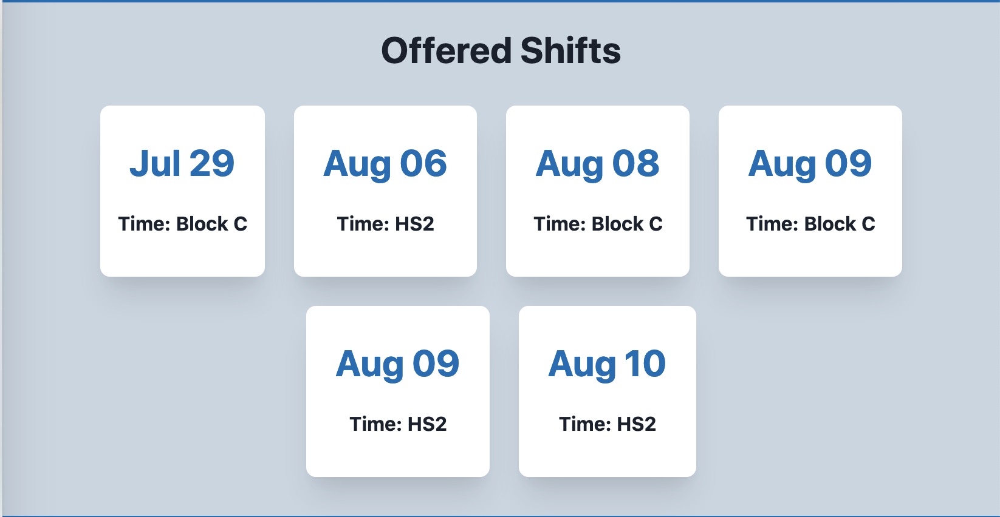

# Requesting Shift Changes

You may submit a request using one of two methods:

## Link in the header

You may click "Submit Shift" at the top of the site, and then fill out the form to offer or take a shift.

## Link on an offered shift

You may also click on an offered shift and it will prefill the submission form with the shift's info. This may be alittle more convenient for taking shifts than the above option.