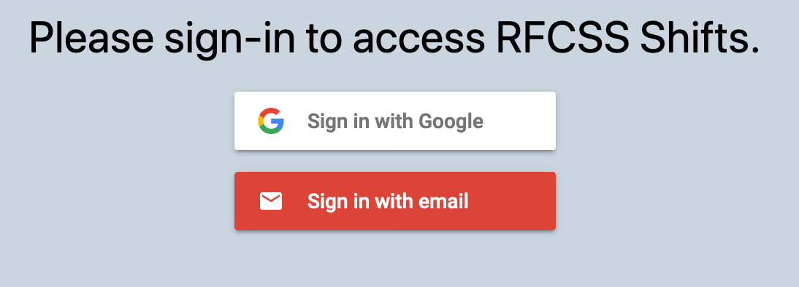
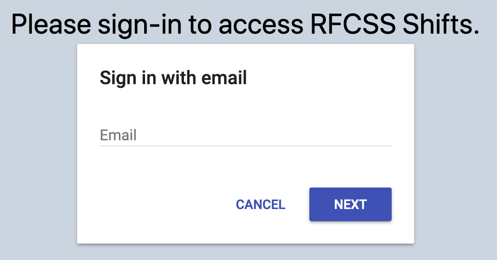
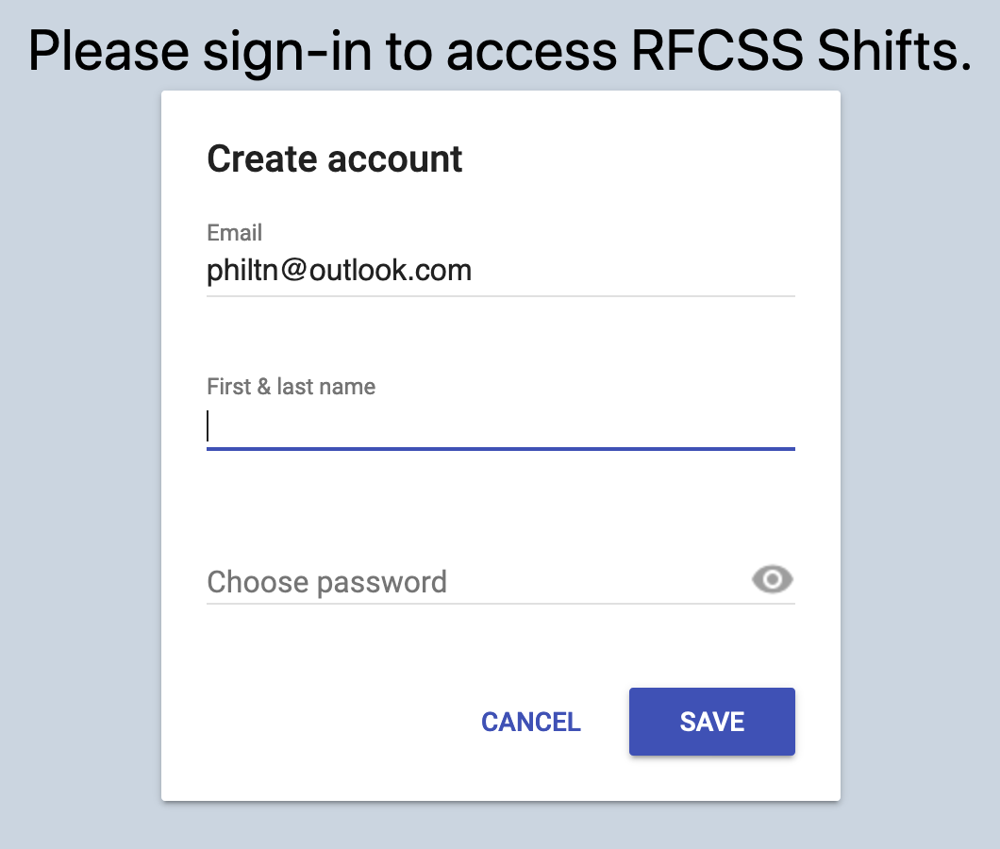
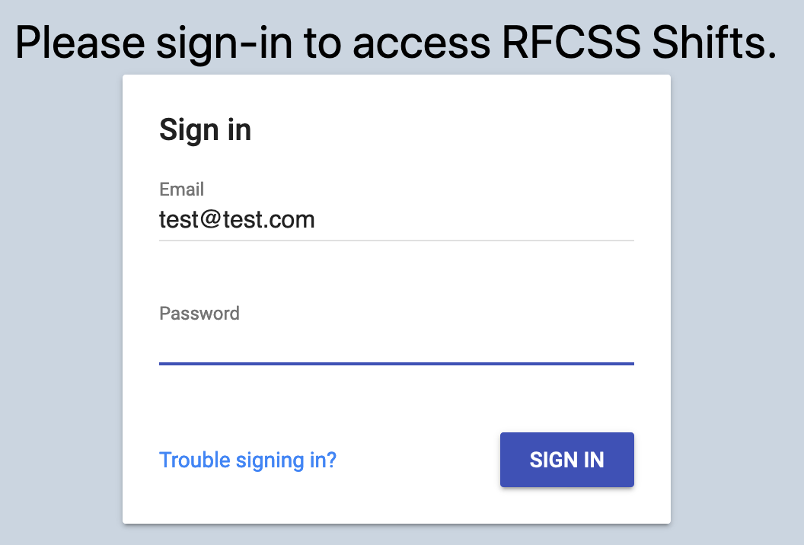
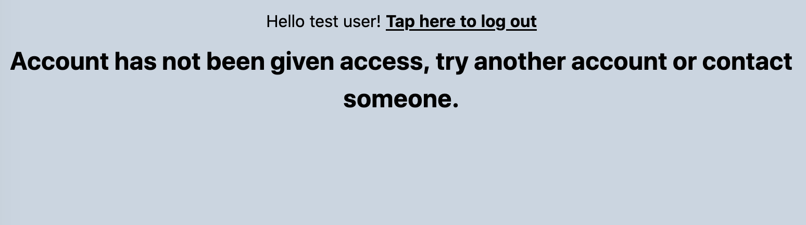
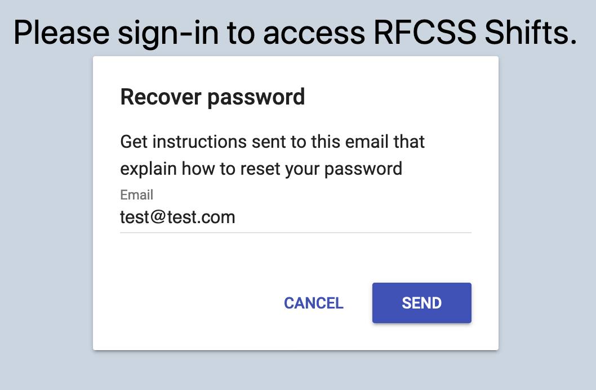

# Managing your Account

To access the web app you must first sign in. You may do so by visiting [shifts.rimbeyfcss.com](https://shifts.rimbeyfcss.com/) and clicking login. You should then see something similar to the image below:

You may then select the appropriate sign in method (select sign in with email if unsure).

After submitting your email, you will either see an option for creating an account or for signing into an existing account, depending if you have already made an account with that email:

If you are creating a new account using your email (and not Google), you will need to check your email account for a verification email sent to you. If you cannot find it check in your spam folder.

After verifying your account, sign out and back in again.

If you see the following page after signing in, contact administration:

Otherwise, you should not see the web app! If you forgot your password, click the "trouble signing in?" text at the bottom of the sign in page, as shown below:

